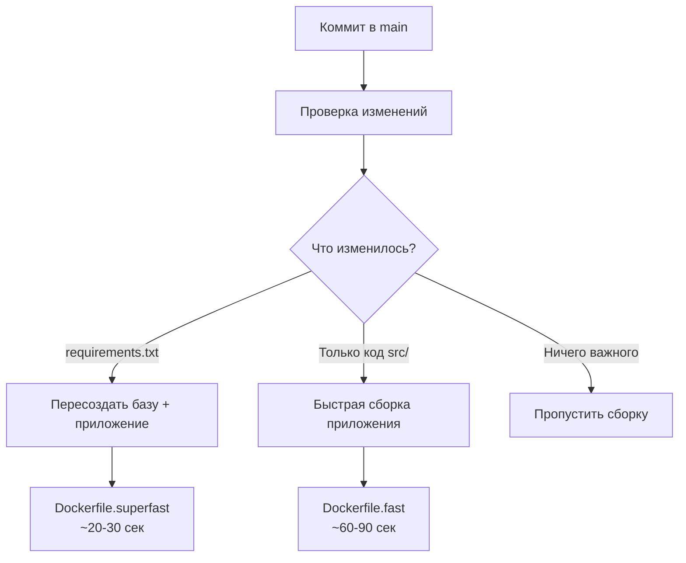

# 🚀 Оптимизированный CI/CD для CB500F

## Обзор GitHub Workflows

### 1. 🏗️ `build-base.yml` - Создание базового образа
**Когда запускается:**
- При изменении `requirements.txt` или `Dockerfile.base`
- Ручной запуск через GitHub Actions
- Первоначальная настройка проекта

**Что делает:**
- Создает базовый образ с Python + Playwright + зависимостями
- Публикует в Docker Hub как `klimdos/cb500-base:latest`
- Кэширует слои для быстрых пересборок
- Тестирует образ на корректность

### 2. ⚡ `docker-publish.yml` - Умная сборка приложения
**Когда запускается:**
- При push в main
- При создании тегов
- При pull request (только тест, без публикации)

**Умная логика:**


### 3. 📊 `performance-monitor.yml` - Мониторинг производительности
**Когда запускается:**
- Раз в неделю автоматически
- Ручной запуск для проверки

**Что проверяет:**
- Время сборки всех стратегий
- Размеры образов
- Процент экономии времени
- Рекомендации по оптимизации

## Стратегии сборки

### 🚀 Superfast (с собственной базой)
```yaml
# Использует klimdos/cb500-base:latest
file: Dockerfile.superfast
time: 20-30 секунд
when: Когда есть собственный базовый образ
```

### 🐧 Fast (с Microsoft базой)
```yaml
# Использует mcr.microsoft.com/playwright/python
file: Dockerfile.fast  
time: 60-90 секунд
when: Fallback когда нет собственной базы
```

### 🐌 Original (полная сборка)
```yaml
# Собирает все с нуля
file: Dockerfile
time: 5-6 минут
when: Только для сравнения производительности
```

## Настройка секретов в GitHub

Необходимые секреты в Settings → Secrets and variables → Actions:

```bash
DOCKERHUB_USERNAME=klimdos
DOCKERHUB_TOKEN=dckr_pat_xxxxxxxxxxxxx
```

## Команды для разработчиков

### Первоначальная настройка:
```bash
# 1. Создать базовый образ (через GitHub Actions)
# Идем в Actions → "Build Base Image" → Run workflow

# 2. Или локально
./fast-build.sh build-base
./fast-build.sh push-base
```

### Ежедневная разработка:
```bash
# 1. Делаем изменения в коде
git add src/
git commit -m "улучшил парсинг"
git push origin main

# 2. GitHub автоматически:
#    - Определит что изменился только код
#    - Использует быструю сборку (~60-90 сек)
#    - Опубликует новый образ
```

### При изменении зависимостей:
```bash
# 1. Изменяем requirements.txt
echo "new-package==1.0.0" >> requirements.txt
git add requirements.txt
git commit -m "добавил новую зависимость"
git push origin main

# 2. GitHub автоматически:
#    - Пересоздаст базовый образ (5-6 мин)
#    - Соберет приложение с новой базой (~20-30 сек)
#    - Опубликует оба образа
```

## Мониторинг и отладка

### Просмотр логов сборки:
```bash
# Локально
./fast-build.sh time-test

# В GitHub Actions
# Идем в Actions → выбираем workflow → смотрим логи
```

### Проверка размеров образов:
```bash
# Через Docker Hub
open "https://hub.docker.com/r/klimdos/cb500-monitor/tags"
open "https://hub.docker.com/r/klimdos/cb500-base/tags"

# Локально
docker images | grep cb500
```

### Принудительная пересборка базы:
```bash
# В GitHub Actions
# Actions → "Build Base Image" → Run workflow → force_rebuild: true
```

## Экономия времени

### До оптимизации:
- ⏱️ Каждая сборка: 6 минут
- 🔄 10 сборок в день: 60 минут
- 📅 В месяц: 20 часов

### После оптимизации:
- ⚡ Быстрая сборка: 30 секунд  
- 🔄 10 сборок в день: 5 минут
- 📅 В месяц: 2.5 часа
- 💰 **Экономия: 17.5 часов в месяц!**

## Автоматизация для команды

### Pre-commit hook для локальной быстрой сборки:
```bash
# .git/hooks/pre-push
#!/bin/bash
echo "🚀 Building fast Docker image..."
./fast-build.sh build-fast
```

### VS Code tasks для разработки:
```json
// .vscode/tasks.json
{
  "version": "2.0.0",
  "tasks": [
    {
      "label": "Fast Docker Build",
      "type": "shell",
      "command": "./fast-build.sh build-fast",
      "group": "build",
      "presentation": {
        "echo": true,
        "reveal": "always",
        "focus": false,
        "panel": "shared"
      }
    }
  ]
}
```

## Troubleshooting

### Если сборка медленная:
1. Проверьте что базовый образ существует:
   ```bash
   docker pull klimdos/cb500-base:latest
   ```

2. Проверьте стратегию в GitHub Actions логах

3. Принудительно пересоздайте базу через Actions

### Если образ не запускается:
1. Проверьте что все файлы скопированы:
   ```bash
   docker run --rm klimdos/cb500-monitor:latest ls -la /app/
   ```

2. Проверьте права доступа:
   ```bash
   docker run --rm klimdos/cb500-monitor:latest whoami
   ```

### Если GitHub Actions падает:
1. Проверьте секреты Docker Hub
2. Убедитесь что репозиторий публичный или настроены права
3. Проверьте лимиты Docker Hub

## Результат

✅ **Время сборки**: С 6 минут до 20-90 секунд  
✅ **Умная логика**: Автоматический выбор стратегии  
✅ **Кэширование**: Максимальное переиспользование слоев  
✅ **Мониторинг**: Еженедельные отчеты производительности  
✅ **Простота**: Никаких ручных действий для разработчиков
